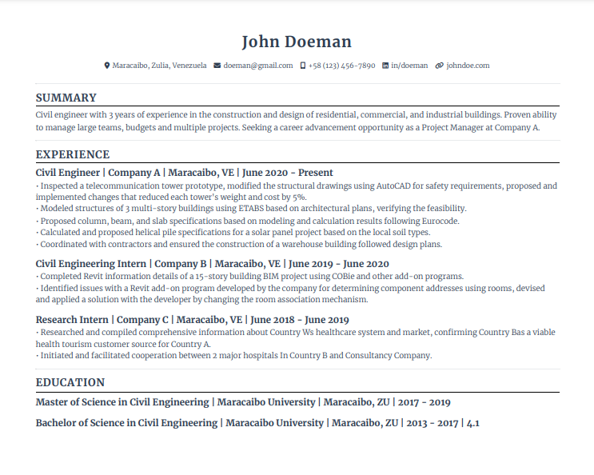

<div align="center">
  
  <h1>Vitae: Resume Builder</h1>

  <p>
  React app that allows users to create their own resume based on a standard template and export it in PDF format
  </p>

  <p>
    <a href="https://github.com/danxschz/cv-app/graphs/contributors">
      
    </a>
    <a href="https://github.com/danxschz/cv-app/commits/main">
      
    </a>
    <a href="https://github.com/danxschz/cv-app/blob/master/LICENSE">
      
    </a>
  </p>

  <h4>
    <a href="https://danxschz.github.io/cv-app">View Demo</a>
    <span> · </span>
    <a href="https://github.com/danxschz/cv-app/issues/">Report Bug</a>
  </h4>
</div>

<br>

## About the Project

### Resume Example

<div align="center"> 
  
</div>

### Built With

- HTML
- CSS
- JavaScript
- React
- npm
- webpack

### Color Reference

| Color             | Hex                                                                |
| ----------------- | ------------------------------------------------------------------ |
| Accent Color | #3C78D8 |
| Text Color | #272624 |

## Getting Started

### Run Locally

In order to setup and work on this project on your own, you will need to:

Clone the project

```bash
  git clone https://github.com/danxschz/cv-app.git
```

Go to the project directory

```bash
  cd cv-app
```

Install dependencies

```bash
  npm install
```

## Usage

- Fill the forms you deem necessary
- Download your resume in PDF format

## License

Distributed under the MIT License. See LICENSE for more information.

## Contact

Daniel Sanchez (@danxschz) - danxschz@gmail.com